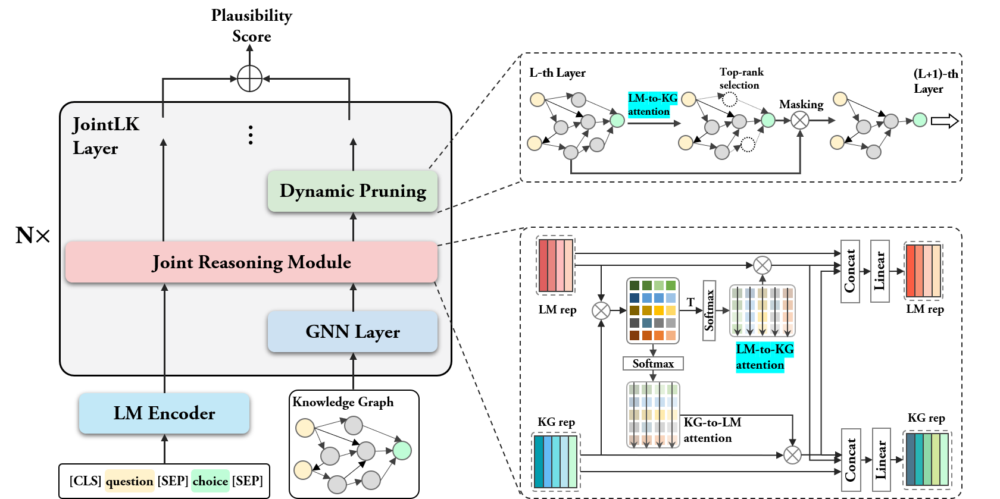

# JointLK: Joint Reasoning with Language Models and Knowledge Graphs for Commonsense Question Answering

This repo provides the source code & data of our paper: [JointLK: Joint Reasoning with Language Models and Knowledge Graphs for Commonsense Question Answering](https://arxiv.org/abs/2112.02732) (NAACL 2021).

For convenience, all data, checkpoints and codes can be downloaded from my [Baidu Netdisk](https://pan.baidu.com/s/1WsEukLdrHELu6q9_qj8NBA?pwd=y5sd).

<p align="center">
  
</p>

## 1. Dependencies

Run the following commands to create a conda environment (assuming CUDA11):
```bash
conda create -n jointlk python=3.7
source activate jointlk
pip install torch==1.7.1+cu110 -f https://download.pytorch.org/whl/torch_stable.html
pip install transformers==3.2.0
pip install nltk spacy==2.1.6
python -m spacy download en
# for torch-geometric
pip install torch-cluster==1.5.9 -f https://pytorch-geometric.com/whl/torch-1.7.1+cu110.html
pip install torch-spline-conv==1.2.1 -f https://pytorch-geometric.com/whl/torch-1.7.1+cu110.html
pip install torch-scatter==2.0.6 -f https://pytorch-geometric.com/whl/torch-1.7.1+cu110.html
pip install torch-sparse==0.6.9 -f https://pytorch-geometric.com/whl/torch-1.7.1+cu110.html
pip install torch-geometric==1.6.3 -f https://pytorch-geometric.com/whl/torch-1.7.1+cu110.html
```
See the file env.yaml for all environment dependencies.

## 2. Download Data
We use preprocessed data from the [QA-GNN](https://github.com/michiyasunaga/qagnn) repository, which can also be downloaded from my [Baidu Netdisk](https://pan.baidu.com/s/1haczfYKB1LlgYZ5MYxMDxQ?pwd=x5sl).

The data file structure will look like:

```plain
.
├── data/
    ├── cpnet/                 (prerocessed ConceptNet)
    ├── csqa/
        ├── train_rand_split.jsonl
        ├── dev_rand_split.jsonl
        ├── test_rand_split_no_answers.jsonl
        ├── statement/             (converted statements)
        ├── grounded/              (grounded entities)
        ├── graphs/                (extracted subgraphs)
        ├── ...
    ├── obqa/
    ├── medqa_usmle/
    └── ddb/
```


## 3. Training JointLK
(Assuming slurm job scheduling system)

For CommonsenseQA, run
```
sbatch sbatch_run_jointlk__csqa.sh
```
For OpenBookQA, run
```
sbatch sbatch_run_jointlk__obqa.sh
```

## 4. Pretrained model checkpoints
CommonsenseQA
<table>
  <tr>
    <th>Trained model</th>
    <th>In-house Dev acc.</th>
    <th>In-house Test acc.</th>
  </tr>
  <tr>
    <th>RoBERTa-large + JointLK <a href="https://pan.baidu.com/s/1rGLPwgwdDd92PvxKgCj8Ug?pwd=adqz">[link]</a></th>
    <th>77.6</th>
    <th>75.3</th>
  </tr>
  <tr>
    <th>RoBERTa-large + JointLK <a href="https://pan.baidu.com/s/10jBkJmN_aAf6FIuSSAESPQ?pwd=4un7">[link]</a></th>
    <th>78.4</th>
    <th>74.2</th>
  </tr>
</table>

OpenBookQA
<table>
  <tr>
    <th>Trained model</th>
    <th>Dev acc.</th>
    <th>Test acc.</th>
  </tr>
  <tr>
    <th>RoBERTa-large + JointLK <a href="https://pan.baidu.com/s/1L8K_DWEPjfpXQ54f6iO8uA?pwd=8bjb">[link]</a></th>
    <th>68.8</th>
    <th>70.4</th>
  </tr>
  <tr>
    <th>AristoRoBERTa-large + JointLK <a href="https://pan.baidu.com/s/17ChzwWw_3fAwvmsD3wFgQg?pwd=23hr">[link]</a></th>
    <th>79.2</th>
    <th>85.6</th>
  </tr>
</table>


## 5. Evaluating a pretrained model checkpoint
For CommonsenseQA, run
```
sbatch sbatch_run_jointlk__csqa_test.sh
```
For OpenBookQA, run
```
sbatch sbatch_run_jointlk__obqa_test.sh
```


## 6. Acknowledgment
This repo is built upon the following work:
```
QA-GNN: Question Answering using Language Models and Knowledge Graphs
https://github.com/michiyasunaga/qagnn
```
Many thanks to the authors and developers!

## Others
We noticed that the [QA-GNN](https://github.com/michiyasunaga/qagnn) repository added test results on the MedQA dataset. To facilitate future researchers to compare different models, we also test the performance of JointLK on MedQA.

For training MedQA, run
```
sbatch sbatch_run_jointlk__medqa_usmle.sh
```
for testing MedQA, run
```
sbatch sbatch_run_jointlk__medqa_usmle_test.sh
```


A pretrained model checkpoint
<table>
  <tr>
    <th>Trained model</th>
    <th>Dev acc.</th>
    <th>Test acc.</th>
  </tr>
  <tr>
    <th>SapBERT-base + JointLK <a href="https://pan.baidu.com/s/1UDCew4dkm-iTA24vko3uGA?pwd=crub">[link]</a></th>
    <th>38.0 </th>
    <th>39.8 </th>
  </tr>
</table>


